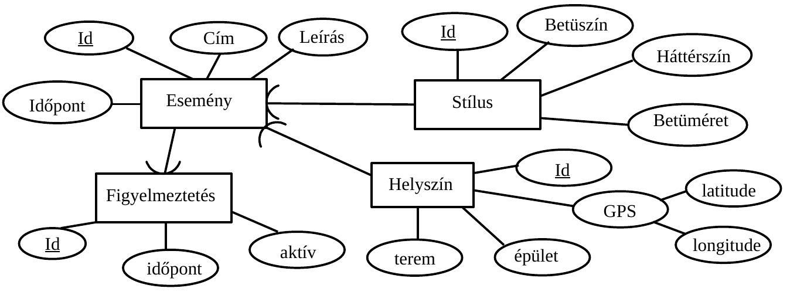
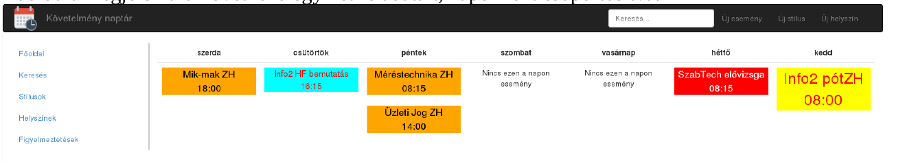
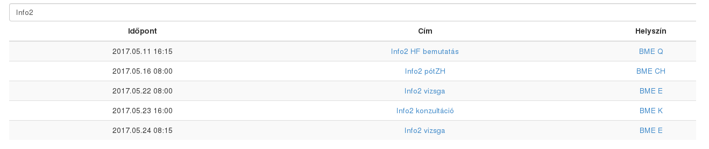
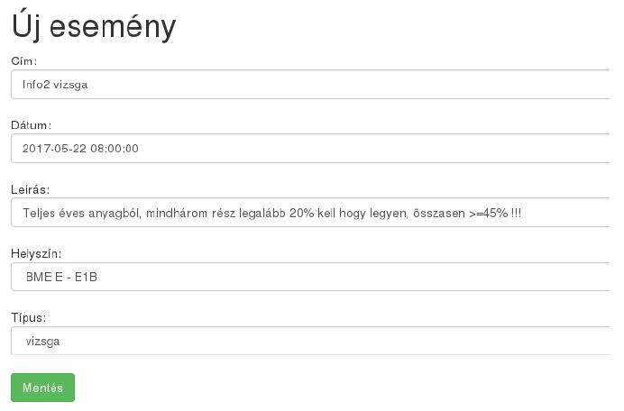
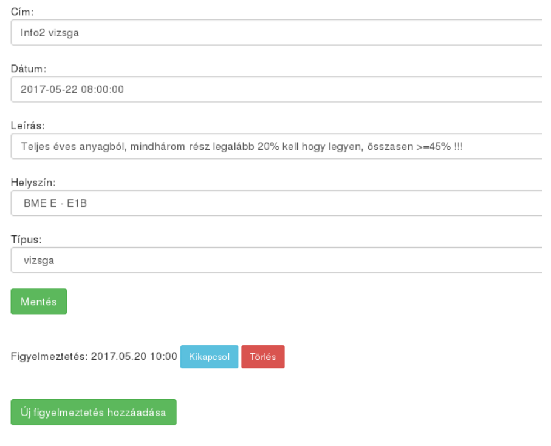
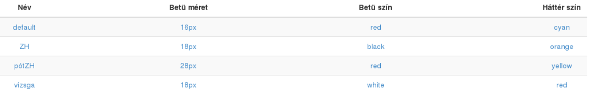
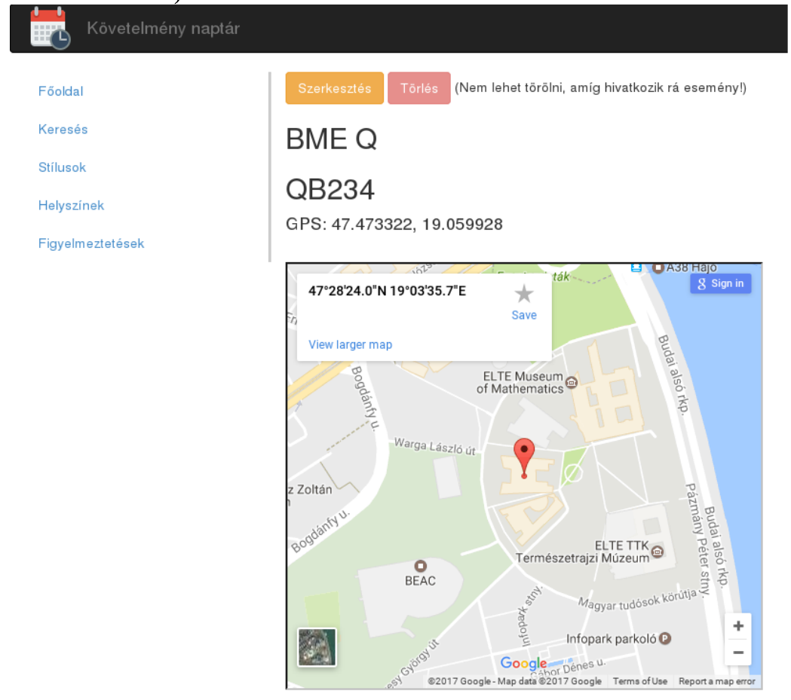
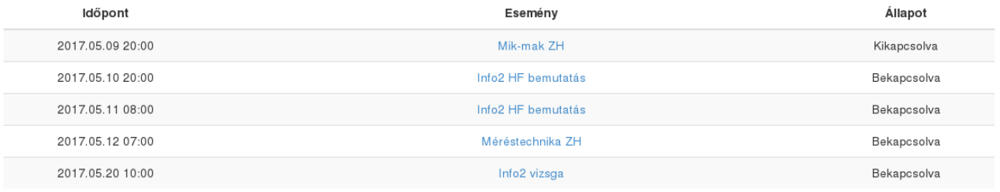

# Követelmény naptár - Documentáció
Kováts Levente, 2017.05.10.

## Specifikáció:
Egy naptár, ami számon tarja a különböző követelmények (nagyZH, kisZH, pótZH, házi, vizsga, ...)
időpontjait és helyszíneit; valamint figyelmeztethet a közelgő eseményekre. Tárolja az esemény címét,
idejét, rövid leírását, helyszínét és megjelenítési stílusát. A stílust dinamikusan lehet meghatározni és
tetszőleges megjelenítést beállítani (háttérszín, betüszín, betüméret), egy egyszer már megadott stílust
lehet többhöz is rendelni. Tetszőleges számú figyelmeztetést lehet beállítani az időpontok előttre.

## Adatbázis:
- Táblák:  
**Esemény** : azonosító, cím, leírás, időpont, stílus_azonosító, helyszín_azonosító  
**Stílus** : azonosító, háttérszín, betüszín, betüméret  
**Helyszín** : azonosító, épület, terem, GPS_lat, GPS_lon  
**Figyelmeztetés** : azonosító, esemény_azonosító, időpont, aktív

## Felhasználói felület:
Minden oldalról elérhető a menü és a keresés, egységes fejléc és lábléc között jelenik meg a kívánt
tartalom.

- **Főoldal** : Megjeleníti a következő egy hét feladatait, naponként csoportosítva.

- **Keresés** : cím és leírás alapján lehet az események között keresni.

- **Új esemény** : új esemény bevitele, meg kell adni az időpontot, címet és leírást, és ki kell választani egy
már létező stílust és helyszínt.

- **Esemény szerkesztése** : esemény adatinak és figyelmeztetéseinek módosítása, vagy az egész esemény
törlése.

- **Stílusok** : Stílusok listázása. Új stílus bevitele (a menüből is elérhető), az adatai megadásával, vagy az
alapértelmezett értékekkel. Stílus adatainak szerkesztése, vagy törlése. (Törölni csak akkor lehet, ha
egy esemény sem hivatkozik rá.)

- **Helyszínek** : helyszínek listázása, megtekintése és módosítása. (Törölni csak akkor lehet, ha egy
esemény sem hivatkozik rá.)

- **Figyelmeztetések** : figyelmeztetések listálya a hozzá kapcsolódó eseménnyel.

## Alkalmazás állományainak felépítése

A főoldal ( _index.php_ ) nyújt egy áttekintő nézetet egy táblázat formályába.
Az események, stílusok, helyszínek és figyelmeztetések kezelését (elkülönítve) rendre az _event.php,
style.php,place.php_ és _alert.php_ valósítják meg. (Ezekben van a létrehozó, módosító és törlő részek.)

Minden oldal elején betöltődik a _before_content.php_ , ami a fejlécet és a menüt tartalmazza, valamint
hasonlóan az oldalak végén az _after_content.php_.

Az egységes stílust a _style.css.php_ valósítja meg, ez minden oldal fejlécében van betöltve. Itt kerül sor a
dinamikus stílusok megvalósítására is.

Minden oldal elején betöltődik a _mylib.php_ állomány. Ebben kerül sor az adatbáziskapcsolat
felépítésére, valamint segédfüggvények definiálására. Az _after_content.php_ végén záródik az
adatbáziskapcsolat.

A felhasználótól kapott adatok a _mysqli::real_escape_string_ illetve az _intval_ függvények segítségével
vannak biztonságosan átadva az adatbázisnak. A felhasználó felé a védelem többek között a
_htmlspecialchars_ függvény segítségével van megoldva.

(A _resetdb.php_ segítségével lehet alaphelyzetbe állítani az adatbázist, néhány tesztadattal.)

